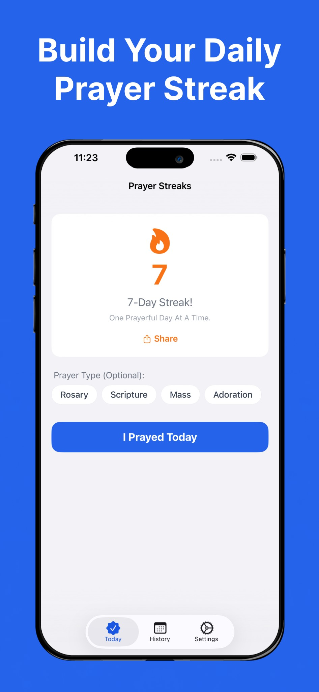
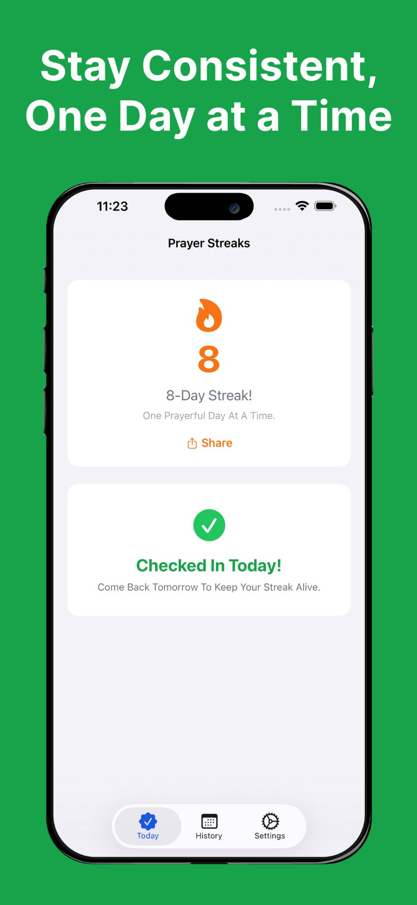
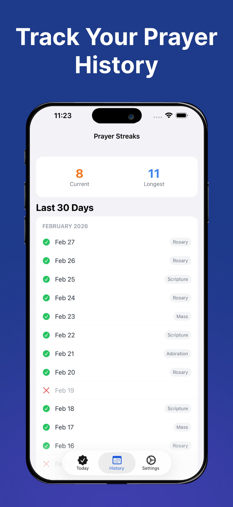
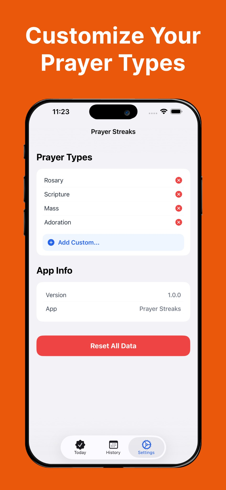

  

  <em>Build a daily prayer habit, one faithful day at a time.</em>

  
  
  
  

  <a href="https://prayerstreaks.com/">Website</a> ·
  <a href="#download">Download</a> ·
  <a href="#screenshots">Screenshots</a> ·
  <a href="CONTRIBUTING.md">Contributing</a>

---

## Overview

Prayer Streaks is a simple, offline-first mobile app that helps you build a daily prayer habit by tracking check-ins and streaks. Log your daily prayers with a single tap, optionally tag each entry with a prayer type (Devotional, Scripture, Worship, Intercession, or your own custom types), and watch your streak grow over time. Built with NativeScript and Angular, the app runs natively on iOS and Android.

## Features

- **One-tap check-in:** Log your daily prayer with a single tap and keep your streak alive.
- **Prayer types:** Tag each day with a category (Devotional, Scripture, Worship, Intercession) or create your own.
- **Streak tracking:** See your current streak at a glance and stay motivated to keep it growing.
- **History view:** Look back on your prayer journey and review past check-ins.
- **Offline-first:** All data is stored locally on your device, with no account or internet connection required.
- **Over-the-air updates:** New features and fixes are delivered instantly through Norrix, with no app store update needed.

## Screenshots

  
  &nbsp;&nbsp;
  
  &nbsp;&nbsp;
  
  &nbsp;&nbsp;
  

## Download

Google Play coming soon.

## Contributing

Contributions are welcome. Please see [CONTRIBUTING.md](CONTRIBUTING.md) for commit conventions, branching rules, and guidelines for submitting pull requests.

## License

[GPL-3.0](LICENSE)
